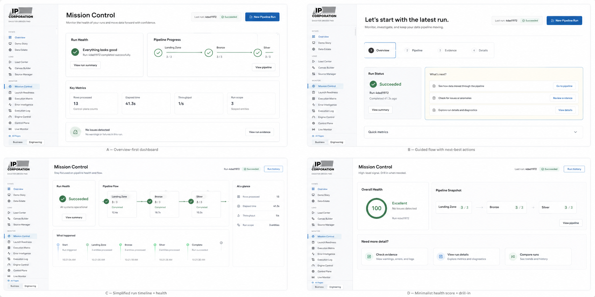
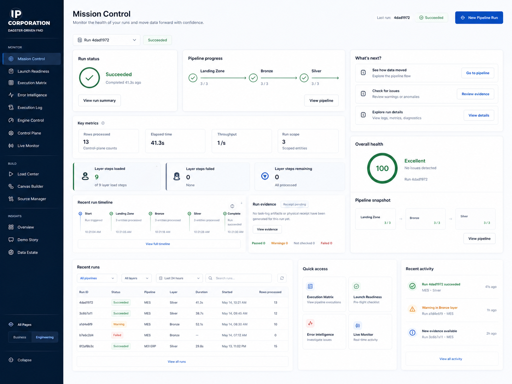
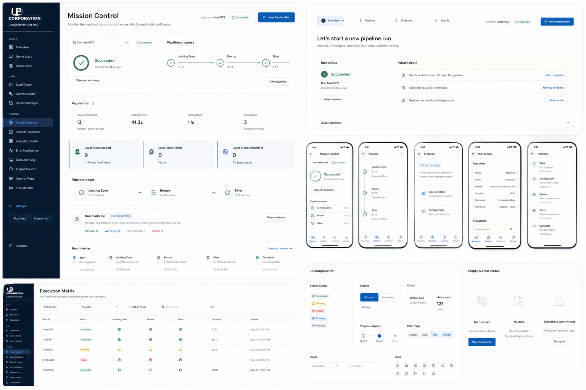

# FMD Dashboard UX Handoff Audit and Implementation Plan

Updated: 2026-04-26

## Purpose

This document is the handoff brief for finishing the FMD Dashboard into a credible IP Corp operating product, not a demo shell.

The core objective is to make the dashboard feel like one integrated solution:

- One place to launch governed loads.
- One place to watch the active run.
- One place to diagnose failures.
- One consistent visual and interaction system.
- No visible engine-choice language.
- No user-facing Dagster branding.
- No "this is wired but not really running" ambiguity.

Dagster, Fabric pipelines, notebooks, local subprocesses, and engine adapters are implementation details. Operators should not need to know which internal runtime is doing the work, and they should never be asked to choose between them from the primary UI.

## Non-Negotiable Product Principle

FMD must present as a single-pane operating workbench.

The user-facing language should be:

- FMD-managed run
- Managed execution
- Pipeline run
- Run plan
- Mission Control
- Evidence / verification receipt
- Source, table, layer, run, failure, retry

Avoid user-facing language such as:

- Dagster
- Orchestrator selection
- Framework mode
- Runtime mode
- Local subprocess
- Dry-run engine
- FMD / Dagster
- Notebook fallback
- Fabric mirror, unless this is a clearly disabled future capability in an admin-only area

Internal payload fields can still use `orchestrator`, `dagster_mode`, `runtime_mode`, and related names if they are already part of the API contract. The requirement is to hide those choices from the operator experience.

## Current Operating Model

The intended user flow is:

1. Source Manager / Source Health: configure or inspect source coverage.
2. Canvas Builder: design or review a governed data flow only when the flow structure matters.
3. Run Pipeline / Load Center: launch the active registered catalog through Landing, Bronze, and Silver.
4. Mission Control: monitor the exact selected run, including progress, failures, and evidence.
5. Error Intelligence / Execution Log: diagnose issues from the selected run context.
6. Advanced Runtime Diagnostics: hidden from the normal path; engineering-only inspection if the underlying runtime service itself needs troubleshooting.

The operator should never wonder whether they should use Canvas, Load Center, Mission Control, Engine Control, Live Monitor, Dagster, Validation, or Execution Matrix to start or monitor a run. The hierarchy must be obvious:

- Build/review the flow in Canvas.
- Launch from Run Pipeline / Load Center.
- Observe from Mission Control.
- Diagnose from Mission Control drilldowns.

## Mockup References

These mockups are included as visual direction, not exact implementation specs.







### What To Extract From The Mockups

Use these ideas:

- Mission Control should open with a calm, high-confidence overview, not a dense raw operations table.
- The selected run should be unmistakable: run id, status, last update, and main action in the header.
- The page should answer "what happened?" before it shows low-level logs.
- The run progress should be visually readable as Landing -> Bronze -> Silver.
- Next-best actions should be explicit: view pipeline, review evidence, inspect details, compare runs.
- Advanced sections should collapse behind clear panels/tabs.
- Evidence should be presented as a receipt with its verification level, not a vague status card.
- Recent runs and recent activity can live lower on the page after the primary run health story.
- Mobile should use a bottom tab flow: Overview, Pipeline, Evidence, Details / Timeline.
- The Execution Matrix should inherit the same status badge and table language as Mission Control.

Do not copy these blindly:

- Do not add fake widgets with no live data source.
- Do not show a dark sidebar unless it is intentionally adopted across the app and verified against the IP Corp visual direction.
- Do not show "Dagster" pills, labels, or component examples in the UI component section.
- Do not over-card the page. The user specifically prefers open-air, intentional layouts over boxes stacked everywhere.
- Do not make every detail visible at once. Use progressive disclosure.

## Target Mission Control Experience

Mission Control should become the simplest and most trustworthy page in the app.

### Above The Fold

Must show:

- Page title: `Mission Control`
- Plain-language summary: `Monitor the health of your runs and move data forward with confidence.`
- Selected run selector.
- Last run id and status.
- One primary action: `New Pipeline Run` only when no run is active, or `Stop Run` only when a run is active.
- Run status panel: succeeded / running / failed / waiting.
- Pipeline progress panel: Landing -> Bronze -> Silver, with each layer's completed versus planned count.
- Next-best actions panel:
  - `View pipeline`
  - `Review evidence`
  - `View details`

### Key Metrics

Show the minimum metrics needed to build confidence:

- Rows processed
- Elapsed time
- Throughput
- Run scope
- Layer steps completed
- Layer steps failed
- Layer steps remaining

Rules:

- Counts must always be scoped to the selected run.
- Global estate counts must never appear as selected-run counts.
- Remaining work must never be a stale all-estate number when the selected run is smaller.
- Terminal succeeded runs should not show work as "currently running."
- Active runs should distinguish planned scope from observed progress.

### Run Evidence

Evidence should be a receipt system with three explicit levels:

- `Verification Pending`: task logs exist, but no independent artifact receipt has been generated yet.
- `Task Log Summary`: the control-plane task rows are internally consistent, but physical artifact verification is not complete.
- `Verification Receipt`: Landing/Bronze/Silver artifacts were checked through OneLake mount, ADLS SDK, or another explicit verification method.

Evidence must show:

- Verification method.
- Checked timestamp.
- Landing artifact status.
- Bronze Delta status.
- Silver Delta status.
- Row count summary.
- Target paths.
- Any warning or failure reason.

The phrase `Real Load Evidence` should not appear unless the page is actually showing physical artifact proof. Prefer `Run Evidence`, `Verification Receipt`, or `Task Log Summary`.

### Recent Timeline

The recent timeline should summarize milestones:

- Start
- Landing Zone
- Bronze
- Silver
- Complete / Failed / Stopped

Each timeline item should show:

- Status icon
- Layer or event name
- Count processed
- Timestamp or duration

Long raw logs should be hidden behind `View full timeline` or a details tab.

## Target Canvas Experience

Canvas is not the live execution proof page. Canvas is for designing and launching a governed flow.

Canvas should:

- Show only production-ready FMD building blocks by default.
- Avoid executor selectors and runtime-choice controls.
- Say `Execution path: Managed automatically by FMD`.
- Let users review the plan and start the run.
- After launch, replace `Start Pipeline` with `Open Mission Control`.
- Animate nodes/connectors only as launch choreography, not as proof that rows landed.
- Route to `/load-mission-control?run_id=<exact-run-id>` after a run starts.

Canvas should not:

- Ask users to pick FMD versus Dagster.
- Show planned Fabric mirror/notebook/external adapter nodes in the default palette.
- Suggest that a modeled future node can run when it cannot.
- Leave the user hunting for the running pipeline.

## Target Load Center Experience

Load Center / Run Pipeline is the canonical place to start an actual catalog load.

It should:

- Default to the active registered catalog.
- Let FMD choose incremental versus full load table-by-table based on metadata and watermark history.
- Provide a plan preview when requested.
- Launch through the managed FMD run path.
- Return a run id and direct Mission Control link.
- Show precise launch failures.

It should not:

- Default to only outstanding gaps when the button reads like a full run.
- Hide fallback execution paths.
- Ask operators to choose dry run, Dagster, notebook, or legacy paths.
- Display "engine" language unless the user is in an advanced diagnostic context.

## Target Navigation

Business/default navigation should stay focused:

- Overview
- Run Pipeline
- Canvas Builder
- Mission Control
- Source Health
- Catalog
- Alerts
- Requests
- Help

Engineering/default navigation can include:

- Overview
- Architecture Story
- Data Estate
- Source Manager
- Canvas Builder
- Run Pipeline
- Mission Control
- Estate Health Matrix
- Error Intelligence
- Execution Log
- Explore / Catalog / Quality / Admin

Show All / advanced navigation can include:

- Advanced Runtime Diagnostics
- Engine Control
- Control Plane
- Live Monitor
- Validation
- Launch / Handoff Readiness
- Pipeline Testing

Rules:

- Do not show Dagster as a branded nav section.
- Do not show advanced runtime pages in the business path.
- If an advanced runtime route remains `/dagster/*`, hide that implementation detail behind labels like `Runtime Diagnostics`.

## Critical Findings

### P0: User-facing runtime leakage

The current app still leaks implementation detail in several places:

- Canvas says `FMD / Dagster`.
- Canvas launch says `accepted by FMD/Dagster`.
- Mission Control says `Dagster dry run` and `Dagster framework`.
- The advanced route is branded as `Dagster`.
- Source onboarding copy says Dagster launches the path.
- The architecture story is currently centered on explaining Dagster instead of explaining the FMD operating model.

Required fix:

- Replace all normal user-facing references with FMD-managed execution language.
- Keep low-level names only in source code, route paths, config, or advanced diagnostic instructions where unavoidable.

### P0: Mission Control is too hard to understand

The page still feels like it is exposing raw implementation state instead of telling the operator the run story.

Required fix:

- Lead with run health.
- Show layer progress as a simple pipeline.
- Show next-best actions.
- Collapse the heavy detail sections.
- Add a recent timeline.
- Make evidence level explicit.
- Move entity matrices and task rows below overview or into tabs.

### P0: Counts can still contradict the user's mental model

The user must never see a run scoped to 3 entities and also see 1,161 or 3,474 remaining steps without an explanation.

Required fix:

- Every Mission Control count must bind to the selected run.
- Show "planned for this run" separately from "observed so far."
- Cap duplicate task-log totals at the planned run scope.
- Mark unobserved active work as `still running`, not as failed or missing.
- For terminal incomplete runs, say `not completed in this run`.

### P0: Too many pages compete for the same job

Run Pipeline, Load Center, Canvas, Mission Control, Live Monitor, Engine Control, Validation, Execution Matrix, Dagster/Runs, and Logs all imply they may be the right place to start or watch work.

Required fix:

- Launch from Load Center.
- Design from Canvas.
- Monitor from Mission Control.
- Diagnose from Mission Control drilldowns.
- Re-home legacy/advanced pages under Show All or route them into tabs.

## Implementation Plan

### Phase 1: User-Facing Vocabulary Cleanup

Search the frontend for:

```text
Dagster
FMD/Dagster
orchestrator
orchestration
framework mode
runtime mode
dry run
engine
local
subprocess
mirror
```

Replace user-facing instances according to this map:

| Current | Replace With |
|---|---|
| Dagster dry run | Plan check |
| Dagster framework | Managed execution |
| FMD / Dagster | Managed by FMD |
| FMD/Dagster framework | FMD-managed execution |
| Orchestration Check | Plan Check |
| Framework mode | Managed load mode |
| Runtime mode | Launch mode |
| Real-load preflight | Launch preflight |
| Engine Control | Runtime Diagnostics or Advanced Runtime |
| Dagster Advanced | Advanced Runtime |
| Open Dagster | Open diagnostics |
| Dagster is not running | Runtime diagnostics are not running |

Do not rename internal API payload fields unless tests are updated and compatibility is preserved.

### Phase 2: Mission Control Redesign

Use the mockups as the direction.

Build the Mission Control page around these sections:

1. Header
2. Run selector and status
3. Run status
4. Pipeline progress
5. What's next
6. Key metrics
7. Layer step summary
8. Recent run timeline
9. Run evidence
10. Recent runs
11. Quick access
12. Recent activity

Progressive disclosure:

- Overview tab: status, progress, metrics, next actions.
- Pipeline tab: layer-by-layer source matrix and entity counts.
- Evidence tab: artifact verification and receipts.
- Details tab: run metadata, task rows, logs, retries.

Mobile:

- Bottom nav tabs: Overview, Pipeline, Evidence, Details.
- Keep one primary card per screen.
- Do not show the full source/layer matrix on the first mobile screen.

### Phase 3: Canvas Cleanup

Implement:

- Hide future/non-production nodes from the default palette.
- Remove executor selector.
- Add read-only `Execution path: Managed automatically by FMD`.
- Replace all dry-run wording with plan validation wording.
- After launch, show:
  - Run accepted
  - Run id
  - Scope
  - Layers
  - `Open Mission Control`
- Keep connector animation only while a run is being handed off.

### Phase 4: Load Center Cleanup

Implement:

- Rename to `Run Pipeline` in user-facing headers if it reduces confusion.
- Keep route `/load-center` if changing routes would cause churn.
- Primary CTA: `Run Active Catalog`.
- Secondary CTA: `Preview Run Plan`.
- Explain full versus incremental in plain language.
- On launch success, route or deep-link to Mission Control for that exact run.
- On launch failure, show exact preflight or start error.

### Phase 5: Source Manager / Source Health

Implement:

- Source Health should have one obvious action: `Run Pipeline`.
- Source onboarding should say:
  - FMD resolves this source to active tables.
  - FMD checks source access and write paths.
  - FMD starts the Landing, Bronze, and Silver load.
  - Mission Control tracks the run and evidence.
- Do not mention Dagster in onboarding copy.

### Phase 6: Navigation Consolidation

Implement:

- Move advanced runtime diagnostics behind Show All.
- Remove Dagster-branded nav labels.
- Consider hiding Engine Control, Live Monitor, Validation, and Load Progress by default.
- Add redirects or explanatory empty states for legacy routes instead of leaving duplicate top-level workflows.

### Phase 7: Evidence and Verification

Implement:

- Receipt payload should include the verification method:
  - `onelake_mount`
  - `adls_sdk`
  - `task_log_only`
  - `not_checked`
- Mission Control should display the method and confidence level.
- A successful run without physical verification should say `Task Log Summary`, not `Verified`.
- A zero-row incremental landing should be a warning/no-op only if prior artifacts exist.
- If prior artifacts are missing, show an explicit blocker.

### Phase 8: Validation and Regression Testing

Run:

```powershell
cd C:\Users\snahrup\CascadeProjects\FMD_FRAMEWORK
$env:PYTEST_DISABLE_PLUGIN_AUTOLOAD='1'
C:\Users\snahrup\CascadeProjects\FMD_ORCHESTRATOR\.venv\Scripts\python.exe -m pytest dashboard/app/api/tests/test_routes_load_center.py -q

cd C:\Users\snahrup\CascadeProjects\FMD_FRAMEWORK\dashboard\app
npx tsc -b --pretty false
npx eslint src/pages/LoadMissionControl.tsx src/features/canvas/FmdPipelineCanvas.tsx src/pages/LoadCenter.tsx src/pages/business/BusinessSources.tsx src/components/layout/AppLayout.tsx
npx vite build
```

If local browser access works in the next session, also verify:

- `/canvas`
- `/load-center`
- `/load-mission-control`
- `/sources-portal`
- `/matrix`
- `/errors`
- `/logs`

Live flow:

1. Open Canvas.
2. Start Pipeline.
3. Confirm run id appears.
4. Click Open Mission Control.
5. Confirm selected run id matches.
6. Confirm counts are scoped and sane.
7. Confirm evidence level is honest.
8. Confirm no user-facing Dagster language appears in normal navigation or page copy.

## Acceptance Criteria

The work is complete only when:

- A non-technical IP Corp user can start at Run Pipeline, launch a run, and know where to watch it.
- Mission Control tells a coherent story for active, succeeded, failed, no-op incremental, and partially completed runs.
- The selected run's numbers reconcile across header, KPI cards, progress pipeline, matrix, timeline, and evidence panel.
- No primary workflow exposes Dagster, runtime choices, engine choices, local subprocesses, or notebook fallbacks.
- Canvas launch hands the user to Mission Control for the exact run id.
- Evidence language matches actual proof level.
- Advanced diagnostics are available for engineering, but not presented as part of the everyday user workflow.
- TypeScript, build, and focused backend tests pass.

## Suggested First Task For The Next Codex Session

Start with the vocabulary cleanup and Mission Control simplification.

Recommended first prompt:

```text
Read docs/UX_HANDOFF_AUDIT_AND_IMPLEMENTATION_PLAN.md and implement Phase 1 plus the first pass of Phase 2.

The product direction is: FMD is one single-pane operating workbench. Do not expose Dagster or engine-choice language in user-facing UI. Mission Control should feel like the mockups in docs/assets/ux-handoff-mockups/, with a clear run status, pipeline progress, next-best actions, metrics, evidence, and timeline.

Do not ask for approval. Implement, run focused tests/build, and report what remains.
```

## Current Checkpoint From Prior Session

Already started or partially implemented:

- Load Center default scope moved toward active catalog.
- Canvas launch handoff points to Mission Control.
- Mission Control started separating planned scope from observed task-log progress.
- Navigation was partially simplified.
- A first pass began removing Dagster language from some components.

The next session should inspect the git diff before continuing and finish the plan systematically rather than assuming all items are done.
