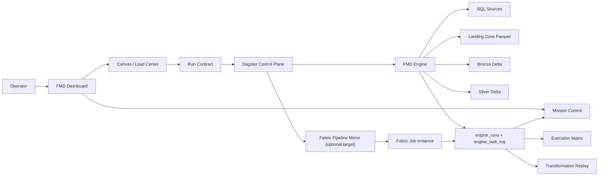

# FMD Launch Readiness Implementation Plan

> **For agentic workers:** REQUIRED SUB-SKILL: Use superpowers:subagent-driven-development (recommended) or superpowers:executing-plans to implement this plan task-by-task. Steps use checkbox (`- [ ]`) syntax for tracking.

**Goal:** Turn the Dagster-driven FMD dashboard, engine, canvas, and Fabric integration into a production-launchable orchestration platform that IP Corp can own after handoff without Steve staying on-board as the operator, maintainer, or tribal-knowledge holder.

**Architecture:** Dagster is the orchestration control plane, FMD remains the data movement and metadata authority, SQLite is the low-latency dashboard truth store, and Fabric is the enterprise execution/storage plane. The dashboard must render from a single canonical run-state contract rather than mixing optimistic UI state, worker liveness, Dagster state, and stale row counts.

**Tech Stack:** Python engine, Dagster OSS, SQLite control-plane DB, React 19 + TypeScript + Vite dashboard, React Flow canvas, Microsoft Fabric Data Factory, Fabric notebooks, OneLake/Lakehouses, Parquet/Delta, Playwright, pytest, CodeQL, Semgrep.

---

## Executive Verdict

FMD is demo-capable but not launch-ready.

The current codebase has strong foundations: a real Python engine, a Dagster launch bridge, real task/run audit tables, a canvas authoring surface, route-level API tests, Playwright coverage, and a dashboard that can present the operating story well. The remaining work is not cosmetic. The product needs one truth contract, verified real data movement, Fabric artifact synchronization, route consolidation, and production-grade validation.

The central launch risk is trust. If the UI says "succeeded", the system must prove:

- Which run succeeded.
- Which scope was selected.
- Which layers actually moved data.
- Which rows/files were written.
- Which physical lakehouse artifacts exist.
- Whether the run was dry-run, local framework, notebook, or Fabric pipeline execution.
- Where the operator goes next if something failed or is still running.

Until that is true, the platform can impress in a demo but cannot be treated as an operational launch.

The ultimate objective is not "Steve can make it work." The objective is "IP Corp can receive it, install it, operate it, troubleshoot it, recover it, update it, and govern it with normal internal staff and documented procedures."

---

## Current State Snapshot

### Verified Repo Facts

- Branch: `feature/fmd-canvas-builder`.
- Recent commits added canvas builder, Mission Control handoff, active connector animation, and clearer planned Fabric mirror language.
- Dashboard app has 85 page files, 41 route modules, 26 API test files, and 24 engine test files.
- `dashboard/app/api/config.json` currently defaults to `engine.orchestrator = "dagster"` and `dagster.runtime_mode = "dry_run"`.
- Canvas launches compile to `/api/engine/start` with `orchestrator: "dagster"`, `dagster_mode: "framework"`, and explicit `entity_ids`.
- Fabric pipeline mirror nodes are modeled only. They do not create, update, or run Fabric Data Factory pipeline artifacts yet.
- Existing docs already capture major known issues in:
  - `docs/REAL_DATA_LOADER_AUDIT.md`
  - `docs/FABRIC_PIPELINE_MIRROR.md`
  - `knowledge/DEFINITION-OF-DONE.md`
  - `knowledge/BURNED-BRIDGES.md`
  - `docs/superpowers/plans/2026-04-24-real-data-loader-completion.md`
  - `docs/superpowers/plans/2026-04-24-fmd-canvas-builder.md`

### Local Environment Fact

This Codex process cannot create Python sockets:

```text
OSError: [WinError 10106] The requested service provider could not be loaded or initialized
```

That blocks API server launch, Dagster launch, browser automation, and Python network tests from this process. Steve's normal shell may be repaired, but launch readiness needs a repeatable environment validator so this never becomes guesswork.

---

## Launch Definition

FMD is launch-ready only when all of these are true.

### Data Movement

- [ ] A one-entity real run extracts from the real SQL source and writes a Landing Zone Parquet file.
- [ ] The same entity promotes to Bronze Delta with row/file audit.
- [ ] The same entity promotes to Silver Delta with SCD columns and row/file audit.
- [ ] A scoped source run works for at least MES, M3 ERP, ETQ, and Optiva.
- [ ] A broad run can load all active entities without the UI lying about progress or completion.
- [ ] Full-estate real loads require explicit confirmation and cannot be triggered by an empty filter bug.

### Orchestration

- [ ] Dagster dry-run mode is visibly and mechanically separate from real framework mode.
- [ ] Dagster framework mode launches real FMD engine work and preserves real task rows.
- [ ] Retry/resume uses the original failed run scope instead of broadening silently.
- [ ] Stop/abort transitions produce terminal audit rows and UI state updates.
- [ ] Fabric pipeline mirror creates or updates real Fabric artifacts only after preview and confirmation.

### Dashboard

- [ ] Every visible button works, opens a real surface, or is removed.
- [ ] Mission Control has one canonical run state with no contradictory labels.
- [ ] Canvas handoff goes to the exact Mission Control run.
- [ ] Dagster pages are integrated without duplicated/confusing navigation.
- [ ] Data Estate, Replay, Execution Matrix, Error Intelligence, Execution Log, Control Plane, Live Monitor, Source Manager, Load Center, and Canvas use real data or visibly explain why a dependency is unavailable.

### Verification

- [ ] `npm run build` passes.
- [ ] `npm run lint` passes or warnings are explicitly triaged.
- [ ] API pytest suite passes.
- [ ] Engine pytest suite passes.
- [ ] Playwright critical route suite passes with no console errors.
- [ ] A real smoke load produces a signed receipt: source row count, target row count, artifact path, run id, task log ids, and physical verification timestamp.
- [ ] CodeQL and Semgrep have no high/critical findings.

### IP Corp Handoff

- [ ] No runtime path depends on `C:\Users\snahrup`, `C:\Users\sasnahrup`, a personal Desktop folder, a personal Downloads folder, or a developer-only worktree.
- [ ] All service identities, secrets, and Fabric permissions are owned by IP Corp, documented, and rotatable.
- [ ] Services can restart after reboot without a developer terminal.
- [ ] A new IP Corp technical owner can install the system from docs and scripts.
- [ ] A non-developer operator can launch, monitor, retry, abort, and verify a scoped pipeline from the dashboard.
- [ ] A support analyst can diagnose common failures from the UI and runbooks without reading source code.
- [ ] Backup, restore, upgrade, rollback, and disaster-recovery steps are documented and tested.

---

## Target Operating Model



The launchable product should feel like one cockpit. Dagster is behind the scenes for operators unless they need low-level run logs. Fabric is an execution/storage platform, not a separate unmanaged universe.

---

## Critical Launch Blockers

### P0-1: Mission Control Shows Contradictory State

**Why it blocks launch:** Operators cannot trust the product if one screen says "succeeded", "in progress", "standing by", "dry run", and "load" at the same time.

**Evidence:** The current page can mix selected run status, engine live status, Dagster mode, stale progress counts, and inferred source scope.

**Primary files:**

- `dashboard/app/src/pages/LoadMissionControl.tsx`
- `dashboard/app/api/routes/load_mission_control.py`
- `engine/api.py`
- `dashboard/app/api/control_plane_db.py`

**Required outcome:** Mission Control renders from a single `MissionRunTruth` contract returned by the API.

### P0-2: Real Data Loader Has Not Been Proven End-to-End In This Build

**Why it blocks launch:** A fast "succeeded" run is not meaningful unless source rows were extracted and physical Parquet/Delta artifacts exist.

**Evidence:** `docs/REAL_DATA_LOADER_AUDIT.md` says real Landing Zone, Bronze, and Silver smoke loads are not complete. Recent logs show some local Bronze/Silver file writes worked historically, but current Dagster-backed path needs proof.

**Primary files:**

- `engine/orchestrator.py`
- `engine/extractor.py`
- `engine/loader.py`
- `engine/bronze_processor.py`
- `engine/silver_processor.py`
- `engine/logging_db.py`
- `engine/dagster_bridge.py`
- `engine/api.py`
- `dashboard/app/api/routes/engine.py`

**Required outcome:** A repeatable one-entity smoke run produces real Landing Zone, Bronze, Silver artifacts and a dashboard receipt.

### P0-3: Dry Run And Real Load Are Still Too Easy To Confuse

**Why it blocks launch:** Users will make operational decisions from the dashboard. Dry-run success must never look like data success.

**Primary files:**

- `dashboard/app/src/pages/LoadMissionControl.tsx`
- `dashboard/app/src/pages/PipelineCanvas.tsx`
- `dashboard/app/src/features/canvas/FmdPipelineCanvas.tsx`
- `dashboard/app/api/routes/canvas.py`
- `engine/api.py`

**Required outcome:** The product uses separate terms, separate counters, separate receipts, and separate buttons for dry-run validation vs real data movement.

### P0-4: Fabric Pipeline Mirror Is Planned, Not Built

**Why it blocks the "ultimate solution":** The canvas currently models Fabric pipeline nodes but cannot create or run matching Fabric Data Factory artifacts.

**Primary files to create or modify:**

- Create `dashboard/app/api/services/fabric_pipeline_client.py`
- Create `dashboard/app/api/services/fabric_pipeline_compiler.py`
- Modify `dashboard/app/api/control_plane_db.py`
- Modify `dashboard/app/api/routes/canvas.py`
- Modify `engine/dagster_bridge.py`
- Modify `engine/api.py`
- Modify `dashboard/app/src/features/canvas/FmdPipelineCanvas.tsx`

**Required outcome:** If a user selects Fabric pipeline mirror, FMD previews, syncs, launches, polls, and audits a real Fabric pipeline artifact under the same FMD run id.

### P0-5: Route And Button Inventory Is Not Launch-Clean

**Why it blocks launch:** The app exposes many surfaces. Some are powerful, some are stale, some use mock data, and some no longer fit the Dagster/FMD workflow.

**Primary files:**

- `dashboard/app/src/App.tsx`
- `dashboard/app/src/components/layout/AppLayout.tsx`
- `dashboard/app/src/pages/*`
- `dashboard/app/src/lib/mockData.ts`
- `dashboard/app/src/data/blenderMockData.ts`
- `dashboard/app/api/routes/*`

**Required outcome:** A route census classifies every page/action as launch-critical, admin-only, demo-only, hidden, merged, or removed.

---

## Implementation Tracks

## Cross-Track Handoff Rules

Every track below must satisfy these handoff rules before it can be considered complete.

- [ ] Replace personal/local paths with configurable install roots such as `FMD_HOME`, `FMD_CONFIG_DIR`, `FMD_LOG_DIR`, and `FMD_DATA_DIR`.
- [ ] Keep developer convenience scripts separate from production install scripts.
- [ ] Every production script supports `-WhatIf` or `--dry-run` where it changes infrastructure, data, or config.
- [ ] Every service has a documented owner, port, log path, config path, restart command, and health check.
- [ ] Every dashboard action has a matching audit event.
- [ ] Every environment variable is listed in `.env.example` with purpose, required/optional status, and owner.
- [ ] Every non-obvious failure mode has a runbook entry with symptoms, cause, verification, and remediation.
- [ ] No feature is complete until an operator can use it without knowing implementation details like Dagster ops, SQLite tables, Fabric REST payloads, or Python module names.

## Track 0: Baseline, Branching, And Environment Gate

**Goal:** Create a stable baseline and stop environment problems from masquerading as product failures.

**Files:**

- Create `scripts/verify_launch_environment.ps1`
- Create `dashboard/app/api/routes/environment.py`
- Modify `dashboard/app/api/routes/__init__.py`
- Modify `docs/REAL_DATA_LOADER_AUDIT.md`
- Modify `.gitignore` if generated environment reports need exclusion

### Task 0.1: Create a launch baseline checkpoint

- [ ] Run `git status --short --branch`.
- [ ] Confirm no unrelated tracked changes are present.
- [ ] Commit only intentional plan/audit docs.
- [ ] Tag the current checkpoint after the audit is accepted:

```powershell
git tag launch-audit-baseline-2026-04-25
```

### Task 0.2: Add local environment validator

**Create:** `scripts/verify_launch_environment.ps1`

The script must check:

- Python executable path.
- Python `_overlapped` import.
- Python socket creation.
- Node executable path.
- Node HTTP bind to `127.0.0.1`.
- Dagster venv Python path.
- Required real-loader packages: `pyodbc`, `polars`, `pyarrow`, `deltalake`, `msal`.
- ODBC Driver 18 availability.
- OneLake mount path exists if configured.
- Dashboard config file resolves without missing required env vars.

Expected output shape:

```json
{
  "ok": false,
  "checks": [
    {"id": "python_socket", "status": "failed", "message": "WinError 10106"},
    {"id": "odbc_driver_18", "status": "passed", "message": "Installed"}
  ]
}
```

### Task 0.3: Expose environment status in the dashboard API

**Create:** `dashboard/app/api/routes/environment.py`

Add:

- `GET /api/environment/launch-readiness`
- `GET /api/environment/python`
- `GET /api/environment/onelake`

The route should never expose secrets. It should return status and remediation only.

### Task 0.4: Add a "Runtime Readiness" panel

**Modify:** `dashboard/app/src/pages/EngineControl.tsx`

The panel should show:

- Socket health.
- Python dependency health.
- Dagster availability.
- OneLake write path health.
- Fabric auth health.
- "Ready for dry run", "Ready for scoped real load", or "Blocked".

---

## Track 1: Canonical Run Truth Contract

**Goal:** Remove contradictory state from Mission Control and every dependent page.

**Files:**

- Modify `dashboard/app/api/routes/load_mission_control.py`
- Modify `engine/api.py`
- Modify `dashboard/app/src/pages/LoadMissionControl.tsx`
- Create `dashboard/app/src/lib/missionRunTruth.ts`
- Create `dashboard/app/src/lib/__tests__/missionRunTruth.test.ts` if a frontend test runner is configured, otherwise cover via Playwright/API tests
- Modify `dashboard/app/api/tests/test_routes_lmc_scope.py`
- Modify `engine/tests/test_lmc_api.py`

### Task 1.1: Define `MissionRunTruth`

The API should return:

```json
{
  "missionTruth": {
    "runId": "abc",
    "status": "succeeded",
    "statusLabel": "Succeeded",
    "isTerminal": true,
    "isRunning": false,
    "runtimeMode": "framework",
    "dataMovement": "real",
    "loadMethod": "local",
    "scope": {
      "label": "3 entities from MES, M3 ERP",
      "sourceNames": ["MES", "M3 ERP"],
      "entityCount": 3,
      "layerCount": 3,
      "layerStepCount": 9
    },
    "progress": {
      "layerStepsCompleted": 9,
      "layerStepsSucceeded": 9,
      "layerStepsFailed": 0,
      "layerStepsRemaining": 0,
      "rowsRead": 13,
      "rowsWritten": 13,
      "filesWritten": 3
    },
    "warnings": [],
    "nextAction": {
      "kind": "view_outputs",
      "label": "View loaded tables",
      "to": "/load-mission-control?run_id=abc&tab=outputs"
    }
  }
}
```

### Task 1.2: Derive truth from persisted run and task rows only

Rules:

- Selected run `engine_runs.Status` is the canonical status.
- `engine.status` can indicate an active worker only when it matches the selected run id.
- Dry-run comes from `LoadType = dry_run`, run mode, or explicit Dagster runtime metadata.
- Scope comes from `engine_runs.EntityFilter`, `SourceFilter`, `ResolvedEntityCount`, and actual scoped entity rows.
- Layer count comes from persisted `Layers`, not the UI default.
- Remaining count is zero for terminal runs.
- Gold is hidden unless the run included Gold and data exists.

### Task 1.3: Replace conflicting header/status widgets

**Modify:** `dashboard/app/src/pages/LoadMissionControl.tsx`

Remove or rewrite:

- "Standing By" when a selected run is terminal.
- "In Progress" row label when selected run is succeeded.
- "Dagster dry run local" when mode is real.
- "Scope all sources" when entity/source filters are present.
- "Layer steps remaining currently running" for terminal runs.

### Task 1.4: Add contradiction tests

**Modify:** `dashboard/app/api/tests/test_routes_lmc_scope.py`

Add fixture data for:

- Terminal succeeded run with stale live engine state.
- Dry-run succeeded run with zero rows.
- Real framework run with scoped source filter.
- Partial failed run.

Expected: `missionTruth` contains no incompatible labels.

---

## Track 2: Real Loader Proof Path

**Goal:** Prove the platform moves real data through Landing Zone, Bronze, and Silver for a tiny scoped run before scaling.

**Files:**

- Modify `engine/orchestrator.py`
- Modify `engine/extractor.py`
- Modify `engine/loader.py`
- Modify `engine/bronze_processor.py`
- Modify `engine/silver_processor.py`
- Modify `engine/logging_db.py`
- Modify `engine/preflight.py`
- Create `scripts/run_real_smoke_load.ps1`
- Create `scripts/verify_real_smoke_load.py`
- Create `docs/REAL_LOAD_SMOKE_RUNBOOK.md`
- Modify `engine/tests/test_loader.py`
- Modify `engine/tests/test_bronze_processor.py`
- Modify `engine/tests/test_silver_processor.py`

### Task 2.1: Select and freeze smoke entities

Use a table that is small, stable, and representative.

Current candidate from prior audit:

```json
{
  "entity_id": 599,
  "source": "MES",
  "namespace": "mes",
  "schema": "dbo",
  "table": "alel_lab_batch_hdr_tbl",
  "historical_rows": 5
}
```

Acceptance:

- [ ] Smoke entity exists in `lz_entities`.
- [ ] Source table is reachable.
- [ ] Source table has non-zero rows.
- [ ] Landing, Bronze, and Silver metadata exists and is active.

### Task 2.2: Add real smoke runner

**Create:** `scripts/run_real_smoke_load.ps1`

The script should:

- Confirm environment is healthy.
- Call `/api/engine/preflight` in framework mode.
- Launch one entity, all layers.
- Poll Mission Control API until terminal.
- Print the run receipt.

### Task 2.3: Add physical artifact verifier

**Create:** `scripts/verify_real_smoke_load.py`

The verifier must check:

- `engine_runs` row exists and is terminal.
- `engine_task_log` has one terminal row per selected entity/layer.
- Landing Zone path exists.
- Bronze Delta `_delta_log` exists.
- Silver Delta `_delta_log` exists.
- `RowsRead`, `RowsWritten`, and `BytesTransferred` make sense by layer.
- Silver output has SCD columns where applicable.

### Task 2.4: Fix Delta type edge cases

Historical logs show failures like:

```text
dataframe contains unsupported data types: {Null}
```

Acceptance:

- [ ] Bronze/Silver processors coerce all-null columns to a safe string or inferred nullable type.
- [ ] Tests cover an all-null column.
- [ ] Tests cover mixed numeric/string drift.
- [ ] Failure messages name the table, column, layer, and suggested remediation.

### Task 2.5: Add receipts to Mission Control

Mission Control must show:

- Source rows read.
- Landing file path.
- Bronze table path.
- Silver table path.
- Rows written.
- Files written.
- Verification timestamp.
- "This was a dry run" vs "This moved data".

---

## Track 3: Dagster Integration Hardening

**Goal:** Make Dagster a reliable orchestration layer instead of just an embedded UI.

**Repos:**

- FMD framework: `C:\Users\snahrup\CascadeProjects\FMD_FRAMEWORK`
- FMD orchestrator: `C:\Users\snahrup\CascadeProjects\FMD_ORCHESTRATOR`

**Files in FMD framework:**

- `engine/dagster_bridge.py`
- `engine/api.py`
- `dashboard/app/api/routes/dagster.py`
- `dashboard/app/src/pages/DagsterConsole.tsx`
- `dashboard/app/src/components/layout/AppLayout.tsx`

**Files in orchestrator repo:**

- `src/fmd_orchestrator/resources.py`
- `src/fmd_orchestrator/jobs.py`
- `src/fmd_orchestrator/cli.py`
- `tests/test_resources.py`
- `tests/test_jobs.py`

### Task 3.1: Use Dagster run id and FMD run id explicitly

Acceptance:

- [ ] Every run record stores `FmdRunId`.
- [ ] Every run record stores `DagsterRunId`.
- [ ] Event bridge files include both IDs.
- [ ] Mission Control can open the exact Dagster run.

### Task 3.2: Replace JSONL event bridge with durable event sink

Current JSONL `.runs` bridge is acceptable for local demo, not ideal for launch.

Target:

- Primary: SQLite `dagster_events` table in control-plane DB.
- Secondary: JSONL retained as debug artifact.

Acceptance:

- [ ] Event writes are idempotent.
- [ ] Restart does not lose run state.
- [ ] Events cannot double-count task rows.

### Task 3.3: Add Dagster health and code-location checks

Mission Control and Dagster Console should show:

- Dagster webserver reachable.
- GraphQL reachable.
- Code location loaded.
- Job available.
- Last materialization/run available.
- Daemon status where possible.

### Task 3.4: Make embedded Dagster pages intentional

Rules:

- FMD nav mirrors essential Dagster destinations.
- Embedded iframe should be used only where it adds operator value.
- Duplicate nav inside iframe is acceptable only if hiding it is brittle.
- If FMD cannot reliably crop/hide Dagster chrome, use FMD wrapper pages with clear links into Dagster.

---

## Track 4: Fabric Pipeline Mirror

**Goal:** Make Fabric pipeline nodes in the canvas create and run real Fabric Data Factory artifacts when selected.

**Files:**

- Create `dashboard/app/api/services/fabric_auth.py`
- Create `dashboard/app/api/services/fabric_pipeline_client.py`
- Create `dashboard/app/api/services/fabric_pipeline_compiler.py`
- Create `dashboard/app/api/tests/test_fabric_pipeline_compiler.py`
- Create `dashboard/app/api/tests/test_routes_canvas_fabric.py`
- Modify `dashboard/app/api/control_plane_db.py`
- Modify `dashboard/app/api/routes/canvas.py`
- Modify `dashboard/app/src/features/canvas/types.ts`
- Modify `dashboard/app/src/features/canvas/flowCompiler.ts`
- Modify `dashboard/app/src/features/canvas/FmdPipelineCanvas.tsx`
- Modify `engine/api.py`

### Task 4.1: Add Fabric artifact registry

Add table:

```sql
CREATE TABLE IF NOT EXISTS fabric_artifacts (
  id INTEGER PRIMARY KEY AUTOINCREMENT,
  FlowId TEXT NOT NULL,
  NodeId TEXT NOT NULL,
  ArtifactType TEXT NOT NULL,
  WorkspaceId TEXT NOT NULL,
  ArtifactId TEXT,
  DisplayName TEXT NOT NULL,
  DefinitionHash TEXT NOT NULL,
  LastSyncStatus TEXT NOT NULL,
  LastSyncAt TEXT,
  LastRunInstanceId TEXT,
  CreatedAt TEXT NOT NULL,
  UpdatedAt TEXT NOT NULL,
  UNIQUE(FlowId, NodeId, ArtifactType, WorkspaceId)
);
```

### Task 4.2: Build Fabric REST client

Required methods:

- `get_item(workspace_id, item_id)`
- `find_item_by_name(workspace_id, display_name, item_type)`
- `create_data_pipeline(workspace_id, display_name, definition)`
- `update_data_pipeline_definition(workspace_id, item_id, definition)`
- `run_item(workspace_id, item_id, job_type)`
- `get_job_instance(workspace_id, item_id, job_instance_id)`
- `poll_job_instance(...)`

Do not use `azure.identity`. Use the raw token pattern documented in `knowledge/BURNED-BRIDGES.md`.

### Task 4.3: Compile canvas to Fabric pipeline definition

The compiler must:

- Generate stable display names: `FMD_<flowName>_<nodeId>`.
- Include FMD metadata in description or annotations.
- Use named connections and parameters, not secrets.
- Support one selected scope at first.
- Refuse full-estate compile unless explicit confirmation exists.

### Task 4.4: Add Fabric preview endpoint

Add:

```text
POST /api/canvas/flows/{flow_id}/fabric/preview
```

Returns:

- Artifact name.
- Workspace.
- Definition hash.
- Create vs update.
- Scope.
- Required permissions.
- Warnings.

### Task 4.5: Add Fabric sync endpoint

Add:

```text
POST /api/canvas/flows/{flow_id}/fabric/sync
```

Acceptance:

- [ ] Creates or updates the Fabric artifact.
- [ ] Writes registry row.
- [ ] Returns artifact ID and open URL.
- [ ] Does not launch the run automatically unless explicitly requested.

### Task 4.6: Add Fabric launch and polling

Acceptance:

- [ ] Canvas run can choose `executionTarget = "fabric_pipeline"`.
- [ ] Engine creates FMD run row before launch.
- [ ] Fabric run instance ID is stored.
- [ ] Polling updates `engine_task_log` and `engine_runs`.
- [ ] Mission Control shows Fabric execution target and exact Fabric run link.

---

## Track 5: Canvas Productization

**Goal:** Make the canvas feel premium and operational, not a diagram that happens to have a Start button.

**Files:**

- `dashboard/app/src/features/canvas/FmdPipelineCanvas.tsx`
- `dashboard/app/src/features/canvas/flowCompiler.ts`
- `dashboard/app/src/features/canvas/types.ts`
- `dashboard/app/src/index.css`
- `dashboard/app/tests/canvas-builder.spec.ts`

### Task 5.1: Add launch receipt and live run overlay

When a run starts:

- [ ] Animate only nodes/edges in the compiled run plan.
- [ ] Show current node, next node, elapsed time, and current run id.
- [ ] Show button: "View this run in Mission Control".
- [ ] Keep the receipt visible until the user dismisses it or navigates.

### Task 5.2: Add exact Mission Control deep link

Canvas must route to:

```text
/load-mission-control?run_id=<runId>
```

Mission Control must select that run from the URL.

### Task 5.3: Add node-level execution history

Each node should expose:

- Last run id.
- Last status.
- Last rows read/written.
- Last failure reason.
- Last run duration.
- Link to filtered Execution Log.

### Task 5.4: Add "planned target" clarity

If a node is Fabric mirror planned-only:

- [ ] It cannot be presented as active execution.
- [ ] It shows "Preview only" or "Sync required".
- [ ] Start Pipeline does not imply Fabric artifact creation unless sync exists.

---

## Track 6: Dashboard Route Consolidation And UX Cleanup

**Goal:** Remove confusion. Make the app feel like one product with a clear operating lifecycle.

**Files:**

- `dashboard/app/src/App.tsx`
- `dashboard/app/src/components/layout/AppLayout.tsx`
- `dashboard/app/src/pages/*`
- `dashboard/app/src/components/*`
- `dashboard/app/tests/critical-pages.spec.ts`
- Existing route audit docs in `dashboard/app/AUDIT-*.md` and `dashboard/app/audits/*`

### Task 6.1: Build route census

Create `docs/LAUNCH_ROUTE_CENSUS.md`.

Every route gets:

- Route path.
- Page component.
- Persona.
- Primary user job.
- Data source.
- Real/mock/stub classification.
- Primary CTA.
- Launch status: keep, merge, hide, admin-only, remove.
- Required test.

### Task 6.2: Hide or remove non-launch surfaces

Rules:

- If a page uses mock data and is not explicitly demo-only, hide it.
- If two pages do the same job, merge or redirect.
- If a button does not work, remove it or disable it with visible reason text.
- Preserve legacy redirects where practical.

### Task 6.3: Align core surfaces to the IP Corp design system

Apply the local `.interface-design/system.md`:

- White/cool gray/IP blue.
- No cream/beige.
- Borders-only.
- Status rail for semantic state.
- Open-air pages, avoid stacked boxes.
- Collapsible details instead of showing everything all at once.
- One clear primary action per page.

### Task 6.4: Launch-critical page list

These pages must be real and tested first:

- `/overview`
- `/estate`
- `/sources`
- `/load-center`
- `/canvas`
- `/load-mission-control`
- `/matrix`
- `/errors`
- `/logs`
- `/control`
- `/live`
- `/replay`
- `/dagster`
- `/dagster/runs`
- `/dagster/catalog`
- `/dagster/jobs`
- `/dagster/automation`
- `/setup`

---

## Track 7: Source Onboarding And Metadata Automation

**Goal:** A user can add a source and have every table ready to load without framework internals.

**Files:**

- `dashboard/app/src/pages/SourceManager.tsx`
- `dashboard/app/src/components/sources/SourceOnboardingWizard.tsx`
- `dashboard/app/api/routes/source_manager.py`
- `dashboard/app/api/control_plane_db.py`
- `engine/metadata_analyzer.py`
- `engine/optimizer.py`
- `scripts/configure_incremental_loads.py`
- `engine/tests/test_optimizer.py`
- `dashboard/app/api/tests/test_routes_source_manager.py`

### Task 7.1: One-action source onboarding

The flow:

1. Connect.
2. Discover tables.
3. Analyze primary keys and watermarks.
4. Register Landing Zone, Bronze, Silver.
5. Seed queue tables.
6. Seed SQLite control plane.
7. Return "ready to run" receipt.

### Task 7.2: Add safe partial success

If 590 of 596 tables register and 6 fail:

- The 590 successful tables remain registered.
- The 6 failures have clear reasons.
- User can retry only failed tables.
- Pipeline launch defaults only to successfully registered active entities.

### Task 7.3: Make source counts impossible to lie about

Source Manager, Load Center, Mission Control, and Execution Matrix must read the same source/entity registry contract.

---

## Track 8: Observability, Failure Handling, Retry, And Self-Heal

**Goal:** Make failures actionable.

**Files:**

- `engine/self_heal.py`
- `engine/self_heal_worker.py`
- `engine/api.py`
- `engine/logging_db.py`
- `dashboard/app/api/routes/load_mission_control.py`
- `dashboard/app/src/pages/ErrorIntelligence.tsx`
- `dashboard/app/src/pages/ExecutionLog.tsx`
- `dashboard/app/src/pages/LiveMonitor.tsx`
- `dashboard/app/src/pages/LoadMissionControl.tsx`

### Task 8.1: Normalize error taxonomy

Required categories:

- `source_connection`
- `source_query`
- `schema_drift`
- `data_type`
- `onelake_write`
- `delta_write`
- `fabric_api`
- `dagster_launch`
- `worker_exit`
- `timeout`
- `cancelled`

### Task 8.2: Add retry scope receipts

Every retry must show:

- Parent run id.
- Failed entities selected.
- Layers selected.
- New run id.
- What will be skipped because already succeeded.

### Task 8.3: Add operator-safe abort

Abort must:

- Mark active run terminal.
- Mark open task rows failed/interrupted.
- Stop worker where possible.
- Preserve completed work.
- Show exactly what can be retried.

---

## Track 9: Physical Verification And Replay

**Goal:** The dashboard should show what changed in the data, not just that a pipeline completed.

**Files:**

- `dashboard/app/api/routes/transformation_replay.py`
- `dashboard/app/src/pages/TransformationReplay.tsx`
- `dashboard/app/api/routes/data_estate.py`
- `dashboard/app/api/routes/load_mission_control.py`
- Create `dashboard/app/api/services/lakehouse_verifier.py`
- Create `dashboard/app/api/tests/test_lakehouse_verifier.py`

### Task 9.1: Build lakehouse verifier service

The service should verify:

- Landing Parquet file exists.
- Bronze Delta table exists.
- Silver Delta table exists.
- Row counts.
- Delta log freshness.
- Schema columns.
- SCD columns.
- Last modified timestamp.

Do not rely on Fabric SQL Analytics Endpoint unless metadata refresh is explicit.

### Task 9.2: Replay real transformations

Replay page should support:

- Selecting a run.
- Selecting an entity.
- Seeing source columns.
- Seeing Landing output schema.
- Seeing Bronze additions/changes.
- Seeing Silver SCD additions/changes.
- Seeing row count changes and sample rows when safe.

### Task 9.3: Link replay from Mission Control

For every completed entity/layer:

- Add "Replay transformation".
- Add "Open artifact".
- Add "View task log".

---

## Track 10: Security, Secrets, And Governance

**Goal:** Launch without leaking credentials or creating unsafe broad execution.

**Files:**

- `dashboard/app/api/config.json`
- `.env.example`
- `dashboard/app/api/server.py`
- `dashboard/app/api/routes/admin.py`
- `dashboard/app/api/routes/config_manager.py`
- `dashboard/app/api/routes/canvas.py`
- `.github/workflows/codeql.yml`
- `.github/workflows/semgrep.yml`

### Task 10.1: Secrets scan and config hardening

Acceptance:

- [ ] No committed secrets.
- [ ] `config.json` can reference env vars but does not require secrets in source.
- [ ] Canvas DSL rejects literal secrets.
- [ ] API logs redact tokens/secrets.

### Task 10.2: Add execution permissions

For launch:

- Admin/operator roles should be explicit.
- Start/stop/abort/real-load/full-estate actions require operator permission.
- Read-only users can inspect but not launch.

### Task 10.3: Add audit events for privileged actions

Audit:

- Source added.
- Real load launched.
- Full-estate confirmation accepted.
- Fabric artifact created/updated.
- Run aborted.
- Retry launched.
- Config changed.

---

## Track 11: CI, QA, And Release Gates

**Goal:** Launch has a repeatable proof process.

**Files:**

- `.github/workflows/ci.yml`
- `.github/workflows/codeql.yml`
- `.github/workflows/semgrep.yml`
- `dashboard/app/playwright.config.ts`
- `dashboard/app/tests/critical-pages.spec.ts`
- `dashboard/app/tests/canvas-builder.spec.ts`
- `dashboard/app/tests/smoke.spec.ts`
- `dashboard/app/api/tests/*`
- `engine/tests/*`
- `knowledge/qa/test-strategy.md`
- `knowledge/qa/coverage-map.md`

### Task 11.1: Add CI workflow

CI must run:

```powershell
cd dashboard/app
npm ci
npm run build
npm run lint
npx playwright test tests/critical-pages.spec.ts --reporter=list
cd ../..
python -m pytest dashboard/app/api/tests -q
python -m pytest engine/tests -q
```

For Windows-specific real-loader tests, use a separate self-hosted or manual gate.

### Task 11.2: Add launch smoke matrix

Required smoke scenarios:

- Dry-run canvas launch.
- Real one-entity Landing run.
- Real one-entity Landing -> Bronze -> Silver run.
- Failed entity retry.
- Abort active run.
- Open exact Dagster run from Mission Control.
- Open exact Replay page from completed task.
- Source onboarding preview.

### Task 11.3: Add visual QA pass

For each launch-critical page:

- Desktop 1920x1080.
- Laptop 1366x768.
- Minimum 1280x720.
- No horizontal layout breakage.
- No console errors.
- No cream/beige regressions.
- No confusing disabled buttons.

---

## Track 12: Deployment And Packaging

**Goal:** Make the product installable, restartable, supportable, and eventually packageable without personal developer context.

**Files:**

- `dashboard/SERVER_REQUIREMENTS.md`
- `VSC_FABRIC_HANDOFF.md`
- `scripts/bootstrap_vsc_fabric_runtime.ps1`
- `scripts/deploy_vsc_fabric.ps1`
- `deploy_from_scratch.py`
- `deploy_prod.py`
- Create `scripts/start_fmd_stack.ps1`
- Create `scripts/install_fmd_services.ps1`
- Future desktop wrapper files if Electron/Tauri is chosen

### Task 12.1: Single command local stack

Command:

```powershell
.\scripts\start_fmd_stack.ps1 -Mode framework -DashboardPort 5288 -ApiPort 8787 -DagsterPort 3006
```

Starts:

- API server.
- Vite dashboard.
- Dagster webserver.
- Dagster daemon if needed.
- Health monitor.

The script must not assume Steve's profile path. It should resolve paths from:

- `FMD_HOME`
- `FMD_ORCHESTRATOR_HOME`
- `FMD_CONFIG_DIR`
- `FMD_LOG_DIR`

Developer defaults can point to local worktrees, but production defaults must be documented separately.

### Task 12.2: VSC-Fabric service install

Install as Windows services:

- FMD API.
- FMD Dashboard static server or IIS.
- Dagster webserver.
- Dagster daemon.

Each service should have:

- Logs.
- Restart policy.
- Health check.
- Service account.
- Recovery behavior after crash.
- Reboot behavior.
- How to rotate secrets without reinstalling.
- Config file path.

### Task 12.3: Desktop app evaluation

Likely path: Electron wrapper around local API/Dagster services.

Decision criteria:

- Can package dashboard shell.
- Can start/stop local services safely.
- Can show service health.
- Can update without breaking enterprise machine policy.
- Does not hide operational logs from support.

Desktop app is valuable after server launch basics are real. Do not do it before real loader and run truth are solved.

---

## Track 13: IP Corp Handoff, Operations, And Supportability

**Goal:** Make FMD transferable to IP Corp as an owned internal platform, not a Steve-maintained prototype.

**Files:**

- Create `docs/operations/IP_CORP_HANDOFF_GUIDE.md`
- Create `docs/operations/INSTALLATION_RUNBOOK.md`
- Create `docs/operations/OPERATOR_RUNBOOK.md`
- Create `docs/operations/SUPPORT_RUNBOOK.md`
- Create `docs/operations/BACKUP_RESTORE_RUNBOOK.md`
- Create `docs/operations/UPGRADE_ROLLBACK_RUNBOOK.md`
- Create `docs/operations/SECURITY_AND_ACCESS_MODEL.md`
- Create `docs/operations/CONFIGURATION_REFERENCE.md`
- Create `docs/operations/OWNERSHIP_MATRIX.md`
- Modify `.env.example`
- Modify `dashboard/SERVER_REQUIREMENTS.md`
- Modify `VSC_FABRIC_HANDOFF.md`
- Modify `scripts/bootstrap_vsc_fabric_runtime.ps1`
- Modify `scripts/deploy_vsc_fabric.ps1`
- Create `scripts/export_handoff_package.ps1`

### Task 13.1: Remove Steve-specific runtime assumptions

Search for and eliminate production dependency on:

- `C:\Users\snahrup`
- `C:\Users\sasnahrup`
- `CascadeProjects`
- personal Desktop scripts
- personal Downloads
- local-only ngrok/portless URLs
- developer-only `localhost` assumptions in production config

Acceptance:

- [ ] Steve-specific paths may exist only in developer docs or local override examples.
- [ ] Production config uses environment variables or an install-root config file.
- [ ] Startup scripts print the resolved paths before launching.
- [ ] A failed path resolution produces a clear message and remediation.

### Task 13.2: Define production install layout

Target example:

```text
C:\ProgramData\FMD\
  config\
  logs\
  state\
  backups\
  runbooks\
C:\Program Files\FMD\
  dashboard\
  engine\
  orchestrator\
```

Acceptance:

- [ ] Config is separate from code.
- [ ] Logs are separate from code.
- [ ] State and backups are separate from code.
- [ ] Upgrades can replace code without deleting config/state.

### Task 13.3: Build handoff package exporter

**Create:** `scripts/export_handoff_package.ps1`

The package should include:

- Built dashboard assets.
- API/engine source or packaged runtime.
- Orchestrator package/version.
- Required config templates.
- Service install scripts.
- Runbooks.
- Version manifest.
- Git commit hash.
- Validation report.

Acceptance:

- [ ] Package generation is repeatable.
- [ ] Package does not include secrets.
- [ ] Package includes exact install instructions.
- [ ] Package includes rollback instructions.

### Task 13.4: Write operator runbook

**Create:** `docs/operations/OPERATOR_RUNBOOK.md`

Must cover:

- Add or verify a source.
- Launch a dry-run orchestration check.
- Launch a real scoped load.
- Watch Mission Control.
- Interpret dry-run vs real-load labels.
- Open exact Dagster run logs.
- Inspect failed entities.
- Retry only failed entities.
- Abort safely.
- Verify Landing/Bronze/Silver outputs.
- Export a run receipt for audit.

Acceptance:

- [ ] Written for a non-developer operator.
- [ ] Includes screenshots captured during final QA for each major operator flow.
- [ ] Uses product labels, not implementation terms.

### Task 13.5: Write support runbook

**Create:** `docs/operations/SUPPORT_RUNBOOK.md`

Must cover:

- Dashboard does not load.
- API service down.
- Dagster down.
- Source database unreachable.
- VPN/gateway unreachable.
- OneLake mount unavailable.
- Fabric API auth failure.
- Run stuck in progress.
- Worker process died.
- Dry-run succeeded but real load blocked.
- Bronze/Silver type failure.
- SQL Analytics Endpoint stale/misleading.
- How to gather logs for escalation.

Acceptance:

- [ ] Each issue has symptoms, likely cause, diagnostic checks, remediation, and escalation criteria.
- [ ] Commands are copy/paste ready for Windows PowerShell.
- [ ] No step requires knowing the source code.

### Task 13.6: Write admin/security runbook

**Create:** `docs/operations/SECURITY_AND_ACCESS_MODEL.md`

Must cover:

- Service principal ownership.
- Required Fabric workspace roles.
- SQL/database permissions.
- Dashboard admin role.
- Operator role.
- Read-only role.
- Secret rotation.
- Audit event retention.
- What actions are privileged.

Acceptance:

- [ ] IP Corp can rotate secrets without code changes.
- [ ] IP Corp can add/remove operators without Steve.
- [ ] Privileged actions are auditable.

### Task 13.7: Write backup/restore and upgrade/rollback runbooks

Must cover:

- SQLite control-plane backup.
- Config backup.
- Dagster state backup.
- Logs retention.
- Fabric artifact registry backup.
- Restore to clean server.
- Upgrade from package.
- Roll back to previous package.
- Validate after restore.

Acceptance:

- [ ] Backup can be run manually.
- [ ] Restore can be tested on a clean machine.
- [ ] Rollback preserves run history and config.

### Task 13.8: Create ownership matrix

**Create:** `docs/operations/OWNERSHIP_MATRIX.md`

Must define:

- Business owner.
- Technical owner.
- Fabric admin.
- Source system owners.
- Security/contact for service principal.
- Support escalation path.
- Release approver.
- Backup owner.

Acceptance:

- [ ] No role says "Steve" as the required long-term owner.
- [ ] Steve can appear only as transition support during handoff.

### Task 13.9: Final handoff rehearsal

Run a rehearsal where the operator follows only the docs.

Acceptance:

- [ ] Fresh install or service restart works from runbook.
- [ ] Dry-run works.
- [ ] Real one-entity load works.
- [ ] Retry failure scenario is demonstrated.
- [ ] Backup is created.
- [ ] Restore or rollback is rehearsed.
- [ ] Handoff gaps are logged and fixed.

---

## 30/60/90-Day Roadmap

### First 30 Days: Make The Current Product Trustworthy

Priority:

- Environment validator.
- Canonical Mission Control truth.
- Real smoke loader.
- Dry-run vs real-load separation.
- Canvas handoff correctness.
- Route census.
- Critical page QA.

Exit criteria:

- One-entity real run works through Landing, Bronze, Silver.
- Mission Control has no contradictory state.
- Canvas launches scoped real run or clearly blocks it.
- Critical routes are classified and hidden/kept intentionally.
- Repeatable local stack startup exists.

### Days 31-60: Make Scoped Operations Reliable

Priority:

- Scoped source runs.
- Retry/resume/abort hardening.
- Physical artifact verification.
- Replay real transformation details.
- Dagster event durability.
- Error taxonomy.
- Source onboarding automation v1.

Exit criteria:

- At least one full source can load through LZ/Bronze/Silver with audited receipts.
- Retry only failed entities works.
- Operators can inspect physical outputs from the dashboard.
- Source onboarding preview and registration works for a new small source.

### Days 61-90: Add Fabric Mirror And Production Controls

Priority:

- Fabric artifact registry.
- Fabric REST client.
- Canvas-to-Fabric pipeline compiler.
- Fabric preview/sync/run/poll.
- Role-based launch controls.
- CI pipeline.
- VSC-Fabric service installation.

Exit criteria:

- Canvas can create/update a Fabric pipeline artifact.
- Fabric pipeline run is tracked under FMD run id.
- Launch-critical CI gates pass.
- Dashboard services restart cleanly.

---

## 6-Month Roadmap

### Month 1: Trust Foundation

- Canonical run truth.
- Real smoke loading.
- Environment gate.
- Critical UI cleanup.
- Route census.

### Month 2: Operational Reliability

- Scoped source runs.
- Retry/resume/abort.
- Physical verification.
- Error taxonomy.
- Operator receipts.

### Month 3: Fabric Mirror MVP

- Fabric registry.
- Fabric compiler.
- Fabric sync and launch.
- Fabric run polling into Mission Control.

### Month 4: Source Onboarding And Scale

- One-action source onboarding.
- Metadata automation.
- Large-source batching.
- Load optimization.
- Performance tuning for 1,666+ entities.

### Month 5: Governance And Enterprise Launch

- Role-based access.
- Full audit trail.
- CI/CD.
- Deployment automation.
- Disaster recovery and rollback runbooks.
- Handoff runbooks and ownership matrix.
- Production install layout independent of developer machines.

### Month 6: Productization

- Desktop app feasibility or implementation.
- Packaged demo/prod profiles.
- Documentation.
- Training flow.
- Final launch QA and stakeholder sign-off.
- IP Corp handoff rehearsal.
- Steve-dependency removal audit.

---

## Checkpoint And Commit Strategy

Each track should land separately.

Suggested checkpoints:

1. `docs: add FMD launch readiness roadmap`
2. `feat(runtime): add launch environment readiness checks`
3. `feat(lmc): add canonical mission run truth`
4. `fix(lmc): remove contradictory run state rendering`
5. `feat(loader): add real smoke load runner and verifier`
6. `fix(delta): handle all-null columns in Bronze and Silver`
7. `feat(canvas): add live run receipt and exact Mission Control handoff`
8. `docs(routes): add launch route census`
9. `feat(fabric): add Fabric artifact registry and client`
10. `feat(fabric): add canvas Fabric preview and sync`
11. `feat(fabric): poll Fabric runs into Mission Control`
12. `feat(ci): add launch critical CI gates`
13. `feat(deploy): add single-command stack startup`
14. `docs(ops): add IP Corp handoff and support runbooks`
15. `feat(install): add production install layout and package exporter`

Rollback rule:

- Every checkpoint must leave the app buildable.
- Fabric mirror work must stay behind explicit feature flags until physical sync is proven.
- Full-estate real loads remain blocked by default until the smoke and source-scope gates pass.

---

## GPT-5.5 Pro Second-Opinion Review

Use GitHub review after this plan is committed and pushed.

Prompt:

```text
Audit this repo as if we need to launch it as a production-grade data orchestration platform.

Focus on:
- end-to-end orchestration correctness
- Dagster integration completeness
- real data loading vs simulated/dry-run behavior
- Microsoft Fabric/lakehouse integration gaps
- dashboard UX contradictions and broken user flows
- pipeline launch, monitoring, retry, failure handling, and replay
- security/config/deployment readiness
- missing tests and observability
- what must be built before launch

Produce:
1. Critical launch blockers
2. Major product gaps
3. Architecture risks
4. UX cleanup requirements
5. 30/60/90-day implementation roadmap
6. Longer 6-month roadmap
7. Suggested milestone commits/checkpoints
```

Compare its output against this document. Accept findings only when they point to concrete files, runnable tests, or a better launch gate.

---

## Immediate Next Build Slice

Do this next:

1. Implement Track 1, canonical Mission Control truth.
2. Add tests for the screenshot contradictions.
3. Update Mission Control to render from `missionTruth`.
4. Run TypeScript build and API tests where the local socket environment allows.
5. Then implement Track 2 smoke runner/verifier.

This order matters. Mission Control is the operator's trust surface. If the real loader works but the screen lies, the product still fails.
